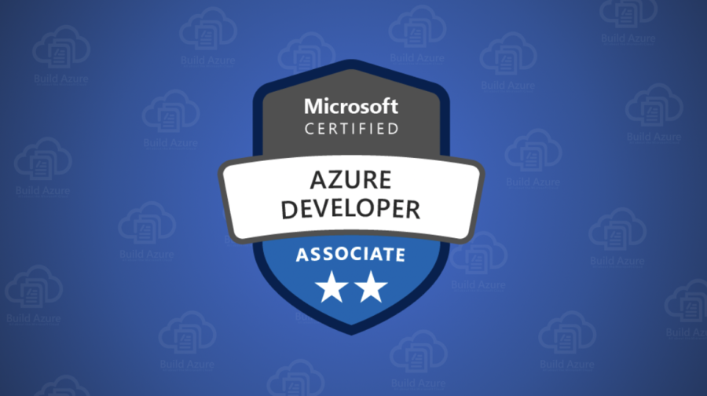

# Azure AZ-900 Certification Guide 🌐

A comprehensive beginner-friendly repository to help you **prepare and crack the Microsoft Azure Fundamentals (AZ-900)** certification with ease. This guide combines **real exam-style questions** and **handwritten conceptual summaries** into one compact learning kit.

---

## 📘 What’s Inside?

This repo includes:

| File | Description |
|------|-------------|
| `Azure_AZ900_ExamQuestions.pdf` | Over 100+ practice questions based on real AZ-900 exam patterns. |
| `Azure AZ900.pdf` | Visual, handwritten summaries covering all core concepts. |

---

## 🧠 Topics Covered

### 🌩️ Cloud Concepts
- Public, Private & Hybrid Cloud Models
- IaaS, PaaS, SaaS comparison
- Scalability, Elasticity, High Availability

### 🏗️ Azure Architecture & Services
- Azure Compute: VMs, App Services, Containers
- Azure Networking: VNets, Gateways, Load Balancers
- Azure Storage: Blob, Table, File, Queue
- Azure Databases & CosmosDB

### 🛡️ Management & Governance
- Azure Pricing, SLAs, and TCO
- Azure Identity: RBAC, Azure AD, MFA
- Azure Monitor, Policy, Blueprints

---

## 🎯 Who Should Use This?

This repository is ideal for:
- 🎓 **Students & Freshers** entering cloud tech
- 🧑‍💻 **IT Professionals** switching to cloud roles
- 🧪 **Certification Aspirants** targeting AZ-900
- 👨‍🏫 **Corporate Trainees** undergoing Azure training

---

## ✅ How to Use

1. **Download the PDFs**
2. **Study the handwritten notes** to understand core concepts visually.
3. **Practice using the MCQs** to evaluate your understanding.
4. **Revisit weak areas** and refine your cloud knowledge.

---

## 📌 Why This Repository?

✨ _Created from real-world training experience, handwritten notes, and actual candidate feedback._  
📚 _Summarized for quick revision & retention_  
🎯 _Laser-focused on AZ-900 exam domains_

---

## 🙌 Contribute

Got more AZ-900 practice questions, corrections, or resources?  
Feel free to fork and submit a Pull Request.

---

## 👨‍💻 Author

**Tamaghna Nag**  
Former SAP Full Stack Engineer, AI Enthusiast, and Cloud Explorer  
📧 tamaghnanag04@gmail.com  
🌐 [Portfolio](https://tamaghnatech.in)  
🔗 [LinkedIn](https://www.linkedin.com/in/tamaghna99/)  
🔗 [GitHub](https://github.com/Tamaghnatech)

---

## 📜 License

This repository is licensed under the MIT License. Use freely, and help others learn!
